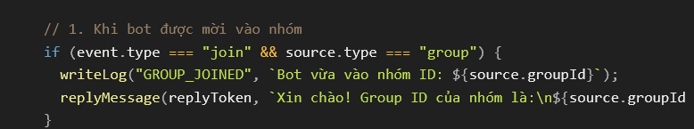

# Làm LINE bot

<aside>
⚠️

Lưu ý:

Các loại tin nhắn gửi tự động, thông báo chung, gửi định kỳ sẽ bị giới hạn 500 tin/tháng

Các loại tin nhắn trả lời theo yêu cầu thì không giới hạn

Một nhóm chỉ cho 1 Line OA tham gia

</aside>

Vào trang [https://account.line.biz/login](https://account.line.biz/login) đăng nhập Line của mình để tạo LineOA

Tự kết bạn Line OA bằng line ID để để nhắn tin thử trước

Tạo Google Trang tính mới tùy ý > vào Extensins > Appscript > xóa hết mã tạo sẵn, dán đoạn mã ở dưới vào

- Mã google app script
    
    ```jsx
    const LINE_ACCESS_TOKEN = "DÁN_CHANNEL_ACCESS_TOKEN_CỦA_BẠN";
    const LOG_SHEET_NAME = "Logs"; // Tên tab muốn ghi log
    
    // Hàm phụ trợ ghi log vào tab riêng
    function writeLog(status, detail) {
      try {
        const ss = SpreadsheetApp.getActiveSpreadsheet();
        let logSheet = ss.getSheetByName(LOG_SHEET_NAME);
        
        // Nếu tab chưa tồn tại, tự động tạo mới và thêm dòng tiêu đề
        if (!logSheet) {
          logSheet = ss.insertSheet(LOG_SHEET_NAME);
          logSheet.appendRow(["Thời gian", "Trạng thái / Loại", "Chi tiết nội dung"]);
          logSheet.setFrozenRows(1);
        }
        
        logSheet.appendRow([
          Utilities.formatDate(new Date(), "Asia/Ho_Chi_Minh", "yyyy-MM-dd HH:mm:ss"),
          status,
          typeof detail === "object" ? JSON.stringify(detail) : String(detail)
        ]);
      } catch (e) {
        // Dự phòng lỗi nếu không ghi được vào Sheet
        console.error("Lỗi khi ghi log:", e);
      }
    }
    
    function doPost(e) {
      try {
        if (!e || !e.postData || !e.postData.contents) {
          writeLog("CẢNH BÁO", "Request nhận được không có postData");
          return ContentService.createTextOutput("No data");
        }
    
        const contents = e.postData.contents;
        // Ghi lại toàn bộ gói tin nhận từ LINE để bạn soi nội dung
        writeLog("INCOMING_RAW", contents);
    
        const json = JSON.parse(contents);
        const events = json.events;
    
        if (!events || events.length === 0) {
          return ContentService.createTextOutput("OK");
        }
    
        for (let i = 0; i < events.length; i++) {
          const event = events[i];
          const replyToken = event.replyToken;
          const source = event.source;
    
          // 1. Khi bot được mời vào nhóm
          if (event.type === "join" && source.type === "group") {
            writeLog("GROUP_JOINED", `Bot vừa vào nhóm ID: ${source.groupId}`);
            replyMessage(replyToken, `Xin chào! Group ID của nhóm là:\n${source.groupId}`);
          }
    
          // 2. Nhận tin nhắn text (hỗ trợ cả Chat riêng lẫn Chat nhóm)
          if (event.type === "message" && event.message.type === "text") {
            const text = event.message.text.trim();
            
            if (text.toLowerCase() === "!getid") {
              if (source.type === "group") {
                writeLog("GET_ID_TRIGGER", `Lấy ID nhóm: ${source.groupId}`);
                replyMessage(replyToken, `ID của nhóm này là:\n${source.groupId}`);
              } else if (source.type === "user") {
                writeLog("GET_ID_TRIGGER", `Lấy ID cá nhân: ${source.userId}`);
                replyMessage(replyToken, `Bạn đang chat riêng với bot!\nUser ID của bạn là:\n${source.userId}\n\n(Nếu muốn lấy Group ID, hãy mời bot vào nhóm rồi gõ !getid trong nhóm nhé)`);
              }
            }
          }
        }
    
        return ContentService.createTextOutput("OK");
      } catch (err) {
        // Bắt toàn bộ ngoại lệ và ghi vào tab Logs
        writeLog("ERROR", err.stack || err.toString());
        return ContentService.createTextOutput("Error: " + err.toString());
      }
    }
    
    // Hàm gửi tin phản hồi có bắt lỗi HTTP
    function replyMessage(replyToken, text) {
      try {
        const url = "https://api.line.me/v2/bot/message/reply";
        const payload = {
          replyToken: replyToken,
          messages: [{ type: "text", text: text }]
        };
    
        const res = UrlFetchApp.fetch(url, {
          method: "post",
          headers: {
            "Content-Type": "application/json",
            "Authorization": "Bearer " + LINE_ACCESS_TOKEN
          },
          payload: JSON.stringify(payload),
          muteHttpExceptions: true
        });
    
        const responseCode = res.getResponseCode();
        const responseBody = res.getContentText();
    
        if (responseCode !== 200) {
          writeLog("LINE_API_ERROR", `HTTP ${responseCode}: ${responseBody}`);
        } else {
          writeLog("REPLY_SUCCESS", `Đã gửi tin nhắn thành công`);
        }
      } catch (e) {
        writeLog("REPLY_FETCH_ERROR", e.stack || e.toString());
      }
    }
    ```
    
- Đoạn mã này có chức năng, gửi log lỗi vào tab Logs trong Trang tính
- Nhận thông tin ID nhóm bằng cách mới vào nhóm hoặc nhắn  `!getid`
- Có thể nhắn line riêng getid để ktra thử

Có thể xóa đoạn *khi bot được mời vào nhóm*  để khỏi tự động gửi group ID, tránh làm phiền



**Triển khai Webhook thành Web App:**

Phải chọn quyền truy cập là 'Bất kỳ ai (Anyone)'.

1. Ở góc trên bên phải màn hình Apps Script, nhấn nút **Triển khai (Deploy)** > chọn **Triển khai mới (New deployment)**.
2. Nhấn vào biểu tượng bánh răng ⚙️ bên cạnh "Chọn loại", chọn **Ứng dụng web (Web app)**.
3. Cấu hình triển khai:
    - **Mô tả (Description)**: *Webhook LINE Bot*
    - **Thực thi dưới dạng (Execute as)**: Chọn **Tôi (Me / email của bạn)**.
    - **Ai có quyền truy cập (Who has access)**: Bắt buộc chọn **Bất kỳ ai (Anyone)**. *(Nếu chọn chỉ mình tôi, LINE API sẽ không thể gửi request tới được).*
4. Nhấn **Triển khai (Deploy)** > cấp quyền Google nếu được yêu cầu.
5. Sao chép đường dẫn **URL ứng dụng web (Web app URL)** (có đuôi `/exec`).

**4.Dán Webhook URL vào LINE Developers Console:**

Kiểm tra kết nối và nhận groupId.

1. Mở [LINE Developers Console](https://developers.line.biz/) > vào Channel Messaging API của bạn.
2. Chuyển sang tab **Messaging API**, tìm mục **Webhook settings**.
3. Dán link Web app URL vừa copy vào ô **Webhook URL** và nhấn **Update**.
4. Bật công tắc **Use webhook** sang màu xanh.
5. Nhấn nút **Verify**: Nếu hiện thông báo `Success` là hệ thống đã kết nối thành công.

**5.Lấy groupId trong nhóm chat:**

- Mời bot vào nhóm chat: Ngay khi vào nhóm, bot sẽ tự gửi tin nhắn chứa `groupId` (bắt đầu bằng chữ `C...`).
- Nếu bot đã ở sẵn trong nhóm từ trước, chỉ cần nhắn tin `!getid`, bot sẽ gửi lại ID nhóm ngay lập tức.